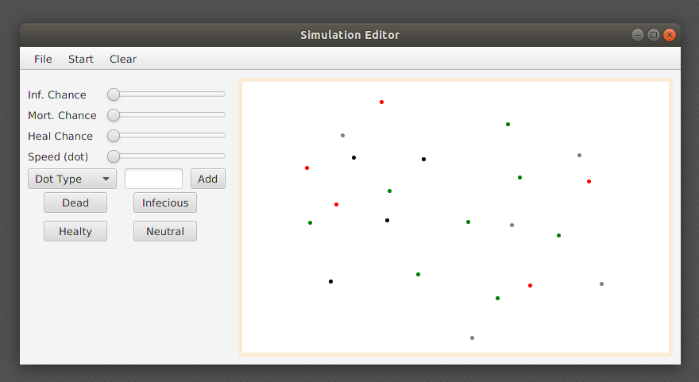

# Prog3: Vírus szimuláció nagyházifeladat

[toc]

## Az ötlet leírása

A program vírus terjedését szimulálja. A pálya egy téglalap lenne, ahhol színes pöttyök tudnának ütközni(kontakt). 4 féle pötty található a pályán:

- Fekete: halott(nem mozog, idővel eltűnik)
-  Piros: fertőző.
-  Zöld: gyógyult.
-  Fehér(szürke) semleges. 

A különböző faktorokat csúszkákkal lehetne állítani: pl: pötty sebessége, milyen eséllyel fertőz, halálozási esély, gyógyulási idő stb. Ha a pötty falnak ütközik, vagy másik pöttyel, akkor visszapattan. A programhoz tartozik egy diagram is, ami a pöttyökről mutat statisztikát.

## A program funkcionalitása a felhasználó szemszögéből

A program indítása után megnyílik a Simulation Editor (1. ábra)-hoz hasonló ablak. Itt lehetőségünk van egy szimuláció előkészítésére. A programrész funciói:

- Szimuláció előkészítése
  - Új (üres) szimuláció létrehozása(File>New)
  - Szimuláció betöltése fájlból (kezdeti értékek) (File>Open simulation)
  - Szimuláció mentése fájlba (kezdeti értékek) (File>Save simulation)
- Kezdeti értékek beállítása
  - Fertőzési esély (Infection Chance slider)
  - Halálozási esély (Mortality Chance slider)
  - Gyógyulási esély (Heal Chance slider)
  - Pötty sebessége(Speed slider)
  - n db pötty felhelyezése véletlenszerűen a pályára (Add button)
  - pöttyök egyessével történő felhelyezése a pályára, egér kattintás alapján (4db button)
  - A pálya kezdeti értékeinek törlése (Clear)
- Szimuláció elindítása
  - Kezdeti értékek alapján(Start >Start )
<figure>
  
  <figcaption>1. ábra - Szimuláció előkészítése.</figcaption>
</figure>

A Start menüpont megnyitásával megnyillik egy új ablak, amiben a vírus szimulációja történik. Ez hasonlóan fog kinézni, mint az Editor. A programrész funkciói: 

- Szimuláció kezelése
  - Idő elindítása, megállítása, gyorsítása, lassítása, léptetés egyesével
  - statisztika megnyitása

A Statistics gomb megnyomása utána megjelenik egy új ablakban a szimulációhoz tartozó statisztika. Ez szintén hasonlóan fog kinézni, mint az Editor.

- Szimuláció statisztikája
  - Olyan diagram(idő szerint), ahol ábrázolva vannak a fontos adatok. (Ferőzöttek, halottak, gyógyultak, stb)

## Megoldási ötlet (vázlat)

A megoldáshoz JavaFX alapú GUI-t fogok használni. A mintaképen látható módon fogom ezt elkészíteni. A kezdeti értékek mentése és betöltése szerializálás segítségével fog történni. A program ( legalább matematikai szempontból) lényeges részeihez JUnit tesztet fogok készíteni.

A csúszkákat $x=0..1$ -ig lehet állítani (kivéve sebesség csúszka), valós számra. A csúszkákhoz tartozó esemény bekövetkezésénél (pl.: ütközés) generálok egy véletlen számot $ 0..1 =r$  között(valós). Ha $ r<x$ , akkor bekövetkezik az esemény (pl.: a kontakt megfertőződik).

A sebesség csúszkát -8 és +8 között lehet állítani. A keletkező sebesség szorzót( $v$ ) az alábbi képtlet fogja számolni: $ v = 2^{\left \lfloor{x}\right \rfloor } $, ahol $ x$ a csúszka által kapott valós szám.

Pötty mozgásának irányát egy 0 és 7 közt generált véletlen egész szám fogja meghatározni
Kontaktálás esetén a pötty1 és pötty2 közepe között kevesebb mint 2r távolság van.